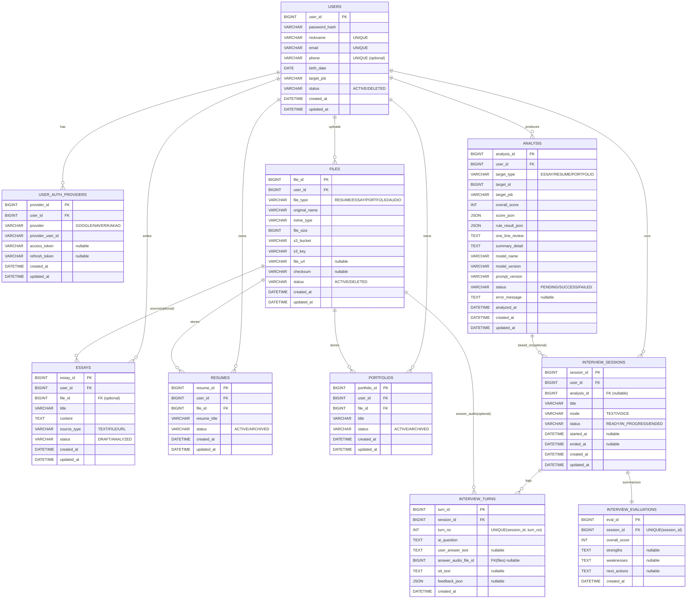

```mermaid
erDiagram

  USERS {
    BIGINT user_id PK
    VARCHAR password_hash
    VARCHAR nickname "UNIQUE"
    VARCHAR email "UNIQUE"
    VARCHAR phone "UNIQUE (optional)"
    DATE birth_date
    VARCHAR target_job
    VARCHAR status "ACTIVE/DELETED"
    DATETIME created_at
    DATETIME updated_at
  }

  USER_AUTH_PROVIDERS {
    BIGINT provider_id PK
    BIGINT user_id FK
    VARCHAR provider "GOOGLE/NAVER/KAKAO"
    VARCHAR provider_user_id
    VARCHAR access_token "nullable"
    VARCHAR refresh_token "nullable"
    DATETIME created_at
    DATETIME updated_at
  }

  FILES {
    BIGINT file_id PK
    BIGINT user_id FK
    VARCHAR file_type "RESUME/ESSAY/PORTFOLIO/AUDIO"
    VARCHAR original_name
    VARCHAR mime_type
    BIGINT file_size
    VARCHAR s3_bucket
    VARCHAR s3_key
    VARCHAR file_url "nullable"
    VARCHAR checksum "nullable"
    VARCHAR status "ACTIVE/DELETED"
    DATETIME created_at
    DATETIME updated_at
  }

  ESSAYS {
    BIGINT essay_id PK
    BIGINT user_id FK
    BIGINT file_id "FK (optional)"
    VARCHAR title
    TEXT content
    VARCHAR source_type "TEXT/FILE/URL"
    VARCHAR status "DRAFT/ANALYZED"
    DATETIME created_at
    DATETIME updated_at
  }

  RESUMES {
    BIGINT resume_id PK
    BIGINT user_id FK
    BIGINT file_id FK
    VARCHAR resume_title
    VARCHAR status "ACTIVE/ARCHIVED"
    DATETIME created_at
    DATETIME updated_at
  }

  PORTFOLIOS {
    BIGINT portfolio_id PK
    BIGINT user_id FK
    BIGINT file_id FK
    VARCHAR title
    VARCHAR status "ACTIVE/ARCHIVED"
    DATETIME created_at
    DATETIME updated_at
  }

  ANALYSIS {
    BIGINT analysis_id PK
    BIGINT user_id FK
    VARCHAR target_type "ESSAY/RESUME/PORTFOLIO"
    BIGINT target_id
    VARCHAR target_job
    INT overall_score
    JSON score_json
    JSON rule_result_json
    TEXT one_line_review
    TEXT summary_detail
    VARCHAR model_name
    VARCHAR model_version
    VARCHAR prompt_version
    VARCHAR status "PENDING/SUCCESS/FAILED"
    TEXT error_message "nullable"
    DATETIME analyzed_at
    DATETIME created_at
    DATETIME updated_at
  }

  INTERVIEW_SESSIONS {
    BIGINT session_id PK
    BIGINT user_id FK
    BIGINT analysis_id "FK (nullable)"
    VARCHAR title
    VARCHAR mode "TEXT/VOICE"
    VARCHAR status "READY/IN_PROGRESS/ENDED"
    DATETIME started_at "nullable"
    DATETIME ended_at "nullable"
    DATETIME created_at
    DATETIME updated_at
  }

  INTERVIEW_TURNS {
    BIGINT turn_id PK
    BIGINT session_id FK
    INT turn_no "UNIQUE(session_id, turn_no)"
    TEXT ai_question
    TEXT user_answer_text "nullable"
    BIGINT answer_audio_file_id "FK(files) nullable"
    TEXT stt_text "nullable"
    JSON feedback_json "nullable"
    DATETIME created_at
  }

  INTERVIEW_EVALUATIONS {
    BIGINT eval_id PK
    BIGINT session_id FK "UNIQUE(session_id)"
    INT overall_score
    TEXT strengths "nullable"
    TEXT weaknesses "nullable"
    TEXT next_actions "nullable"
    DATETIME created_at
  }

  %% Relationships
  USERS ||--o{ USER_AUTH_PROVIDERS : has
  USERS ||--o{ FILES : uploads

  USERS ||--o{ ESSAYS : writes
  FILES ||--o{ ESSAYS : "source(optional)"
  USERS ||--o{ RESUMES : owns
  FILES ||--o{ RESUMES : stores
  USERS ||--o{ PORTFOLIOS : owns
  FILES ||--o{ PORTFOLIOS : stores

  USERS ||--o{ ANALYSIS : produces

  %% target_type/target_id is polymorphic (ESSAY/RESUME/PORTFOLIO)
  %% Mermaid ERD can't enforce polymorphic FK; document it as note in your 발표자료.

  USERS ||--o{ INTERVIEW_SESSIONS : runs
  ANALYSIS ||--o{ INTERVIEW_SESSIONS : "based_on(optional)"
  INTERVIEW_SESSIONS ||--o{ INTERVIEW_TURNS : logs
  FILES ||--o{ INTERVIEW_TURNS : "answer_audio(optional)"
  INTERVIEW_SESSIONS ||--|| INTERVIEW_EVALUATIONS : summarizes

```
